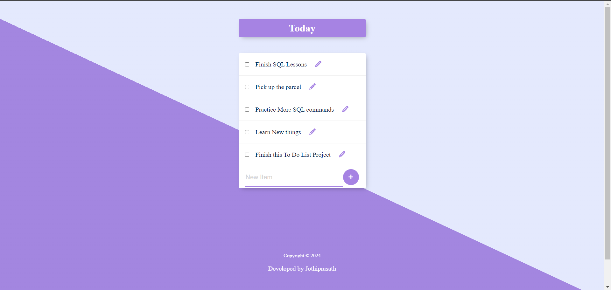

# ToDoList Project

### Project Overview

The **ToDoList** project is a simple yet effective application that allows users to manage their tasks. Built using ```Node.js```, ```Express```, ```EJS```, and ```PostgreSQL```, this project employs **CRUD operations** to enable users to ```create```, ```read```, ```update```, and ```delete``` their todo lists. The project uses several npm packages to facilitate its functionality, including ```body-parser```, ```express```, ```pg```, and ```ejs```. Future enhancements are planned to extend the application to manage tasks for today, the week, and the month.

### To Install Dependencies

```
npm i 

or

npm install
```

## Necessary NPM Packages or Dependencies

* Postgre SQL (Pg) => [pg](https://www.npmjs.com/package/pg)

        - PostgreSQL client for Node.js

* EJS (Embedded Javascript => [ejs](https://www.npmjs.com/package/ejs).

        - Embedded JavaScript templating engine.

* Express => [express](https://www.npmjs.com/package/express).

        - Web framework for Node.js

* Body-parser => [body-parser](https://www.npmjs.com/package/body-parser)

      - Middleware to parse incoming request bodies.

## Features

* ***Create:*** Users can add new tasks to their todo list.
* ***Read:*** Users can view their existing tasks.
* ***Update:*** Users can edit/update the details of their tasks.
* ***Delete:*** Users can remove tasks from their list.

## Usage

**Creating a Task**

1. Go to the homepage.
2. Enter the task description in the input field.
3. Click the "Add Task" (➕)  button.

**Viewing Tasks**

1. All tasks are displayed on the homepage.

**Updating a Task**

1. Click the "Edit" (🖋️️) button next to the task you want to update.
2. Modify the task description.
3. Click the "Save" (✔️) button.


**Deleting a Task**

1. Click the "Delete" which is the checkbox. click that button before to the task you want to remove.


### Technologies Used

* **Node.js:**  Backend runtime environment.
* **Express.js:**  Web framework for Node.js.
* **EJS:** Templating engine for rendering HTML.
* **Postgre SQL:**  Advanced, enterprise-class, and open-source relational database system.
* **CSS:**  Styling the webpage.

### Prerequisites

* Node.js (v12.x or higher)
* npm (Node Package Manager)
* Postgre SQL

### Set up the PostgreSQL database

- Ensure PostgreSQL is installed and running.
- Create a database for the project.
- Set up the database schema

### To start the server 

```
nodemon index.js 

or

node index.js
```

##### Open in Browser

Open your browser and navigate to ```http://localhost:3000``` to view the application.

## Future Enhancements

* **Task Categorization:** Separate tasks into Today, Week, and Month categories.
* **Enhanced User Interface:** Improve the UI for better user experience.
* **User Authentication:** Add user authentication to manage personal todo lists.
* **Reminders and Notifications:** Implement reminders and notifications for tasks.

## Screenshots



## License 

This project is licensed under the MIT License - see the [MIT](https://choosealicense.com/licenses/mit/) License file for details.
